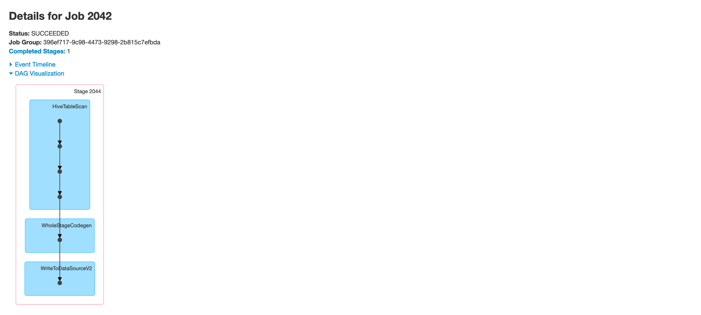

[](https://travis-ci.com/vkrava4/vehicle-auction-stream-processor)
# Vehicle Auction Stream Processor

## Quick Overview

This project represents a data engineering pipeline to answer the following question:
> **Who are the top _N_ traders which should be invited for each car auction?**

### Given
There is a number of predefined entities using which the outcome should be done:
 - New vehicles ready for auctions are coming in stream
 - A bulk data sets of traders (dimensions)
 - A bulk data sets of traders bidding history (facts)
 - 1 value object of vehicle category
 - Traders and bidding history are coming in batches with any arbitrary frequency (e.g. every 12 hours)
 - A trader can be specialised in multiple categories of vehicles (e.g. Sedan and Coupe)
 
### Data Sets


### Goal
> Based on the aforementioned data sets, a solution should be able to calculate which top 20 traders performed better historically 
> in a specific vehicle category; which means to invite them for a new auction, as it is coming in a stream of data.

## Solution

**Criteria for solution stack.** All listed technologies chosen based on the core criteria:
 - Truly scalable, distributed and be highly efficient in data processing and streaming
 - Stability
 - Result with a minimum configuration
 - Popularity, community, ease of integration and ecosystem
 - Personal preference

### Solution stack
 - **Apache Kafka** - highly scalable, fault tolerant distributed message streaming / Pub-Sub system. At the moment #1 on the market.
 - **Apache Spark** - matches all core criteria, in addition it is really fun to work with.
 - **Scala** - fast (vs. Python) and laconic (vs. Java) solution which smoothly integrates the features of Apache Spark and provides support for object-oriented and functional programming.
 - **Hadoop / Azure HDInsight** provides access to [Azure Marketplace](https://azuremarketplace.microsoft.com/en-us/marketplace/), 
 meaning Spark, Kafka, YARN, Oozie, etc as well as internal routing could be installed and configured withing 1 click _(Result with a minimum configuration)_. 
 Personally, however, I prefer to work with Mesos and Chronos vs. YARN and Oozie due to their versatility and transparency. 
 Yet another aspect reason why Azure HDInsight been chosen as a cloud provider is an ability to use Spark and Kafka clusters for free during 
 Free Trial period, while AWS doesn't provide EMR as an option for 
 [Free Tier](https://aws.amazon.com/free/?all-free-tier.sort-by=item.additionalFields.SortRank&all-free-tier.sort-order=asc&awsf.Free%20Tier%20Types=*all&awsf.Free%20Tier%20Categories=*all&awsm.page-all-free-tier=6).
 - **Apache Hive** is used in order to share resulted ranked traders from `TopCategoryTraders` bulk job to `AuctionAdvice` 
 Spark stream application in the most efficient manor, i.e no restarts `AuctionAdvice`, be able to get the latest data anytime, 
 decoupled lifecycle and somewhat audit log.  
 - **Gradle** - rich on [enterprise](https://gradle.com/) features and plugins comparing to SBT.

### Design Schema


 
## Execution
### Cluster Setup
> This setup example will be covering project installation for already configured [Azure HDInsight cluster](https://portal.azure.com/#create/Microsoft.Template/uri/https%3A%2F%2Fhditutorialdata.blob.core.windows.net%2Farmtemplates%2Fcreate-linux-based-kafka-spark-cluster-in-vnet-v4.1.json) 
> from Marketplace, feel free, however, to choose any other image or cloud provider you prefer. Some steps may vary in this case.

**Spark Nodes**

|  Rack |  Node | Containers | Memory Used | Memory Available | VCores Used | VCores Available |
| :---: | :---: | :--------: | :---------: | :--------------: | :---------: | :--------------: |
|DEF|WN1|2|3Gb|9Gb|2|5|
|DEF|WN0|0|0Gb|12Gb|0|7|
|DEF|WN2|0|0Gb|12Gb|0|7|

**Key Properties**


### Data Sets
It is important to stress test a solution, for this purpose 2 datasets: `bids.latest.json` and `traders.latest.json` 
been generated on [Mockaroo](https://mockaroo.com/) and multiplied to mimic 'real-life' volume with Bidding History 
(fact) data ~18Gb and Traders (dimension) list ~21Mb

```
vkrava4@Vlads-MacBook-Pro auction % ls -lh
total 38548024
-rw-r--r--  1 vkrava4  staff    18G bids.latest.json
-rw-r--r--  1 vkrava4  staff    21M traders.latest.json
```

`bids.latest.json`:
```
# File Format

vkrava4@Vlads-MacBook-Pro auction % tail -3 bids.latest.json 
{"bidding_timestamp":"1596579633","trader_id":"36c915e2-f2f7-4a54-bc62-923fbdfb3012","vehicle_id":"76edc9cc-c75e-42e3-a154-77a6560f74c2"}
{"bidding_timestamp":"1596734669","trader_id":"d43dba93-bb16-475a-a8d0-252d65d6ecb6","vehicle_id":"83885c3f-6290-4047-b6de-c0c5e5e0ed2d"}
{"bidding_timestamp":"1596874547","trader_id":"940c8bbf-d73a-4b0e-9019-c42773a618ad","vehicle_id":"4beae8e1-86e2-476b-82e4-459613d0dbec"}

# Number of rows
vkrava4@Vlads-MacBook-Pro auction % wc -l bids.latest.json 
 142737915 bids.latest.json
```

`traders.latest.json`:
```
# File Format

vkrava4@Vlads-MacBook-Pro auction % tail -3 traders.latest.json 
{"trader_id":"d5008e9c-b125-4a56-96ba-2b6c681a88f8","name":"Magdalen Brockelsby","specialised_categories":"Coupe/Van"}
{"trader_id":"6bed0220-9015-41cf-9344-ce1b27b68b1b","name":"Abdul Quested","specialised_categories":"Van/Compact"}
{"trader_id":"c84c528f-8b54-49de-9862-b5e08672d6b3","name":"Heriberto Steven","specialised_categories":"Sedan/Van"}

# Number of rows
vkrava4@Vlads-MacBook-Pro auction % wc -l traders.latest.json 
  193806 traders.latest.json
```

**Importing Data and Apps**

Creating HDFS directory:
```
vssh@hn0-spark:~$ hadoop fs -mkdir /data/auction/
```

Verifying imported batch data:
```
vssh@hn0-spark:~$ hadoop fs -ls /data/auction/
Found 2 items
-rwxrwxrwx   1                 19697832270 2020-08-17 01:54 /data/auction/bids.latest.json
-rwxrwxrwx   1                    22527139 2020-08-16 20:04 /data/auction/traders.latest.json  
```

Spark Fat-Jar is present on the Spark node:
```
vssh@hn0-spark:~$ ls
vehicle-auction-stream-processor-all.jar
```

Kafka producer application is present on the Kafka node:
```
vssh@hn0-kafka:~$ ls
streamer-0.0.1.jar
```

### Environment
```
export KAFKA_BOOTSTRAP_SERVERS="wn0...:9092,wn1...:9092,wn2...:9092"
export BIDS_BATCH="/data/auction/bids.latest.json"
export TRADERS_BATCH="/data/auction/traders.latest.json"
```

**Creating Kafka topics:**
```
/usr/hdp/current/kafka-broker/bin/kafka-topics.sh --create --topic vehicle.auction --replication-factor 3 --partitions 8 --zookeeper zk0-kafka.wru0w5mw0azu5hqx4ztnufpqge.frax.internal.cloudapp.net:2181
/usr/hdp/current/kafka-broker/bin/kafka-topics.sh --create --topic vehicle.auction.traders.advice --replication-factor 3 --partitions 8 --zookeeper zk0-kafka.wru0w5mw0azu5hqx4ztnufpqge.frax.internal.cloudapp.net:2181
```

**Creating Hive database and table:**
```
CREATE DATABASE AUCTION;
CREATE TABLE AUCTION.ranked_traders (category String, category_top_traders String, processed_timestamp Timestamp) stored as ORC;
```

## Executing TopCategoryTraders (Initial processing)

Submitting TopCategoryTraders batch job(1st time) in order to fill in `AUCTION.ranked_traders` traders with results:
```
spark-submit --class com.vladkrava.vehicle.auction.batch.processor.TopCategoryTraders vehicle-auction-stream-processor-all.jar 20
```
_*where: `20` is a rank of Traders_

**Viewing the results**
```
hive> SELECT category, category_top_traders, processed_timestamp FROM AUCTION.ranked_traders;
OK: 

Compact	[294b5960-7b6a-453f-ba26-865aba50b446, ad875cbb-3342-48be-b222-028693d04c92, 4ecc598a-f607-4eb8-afa8-1ab984657327, 087f00c3-9774-4577-9633-39c0d2daf2d8, e0f42174-6a76-4525-b717-a12c807e0d11, 12c0711d-6f6f-4dde-85fe-2d1622cb518a, cef86dbf-b98a-4917-93c6-eaeec1c7187f, f7fd1d50-b9ba-49f6-8463-ef7e0064d4ac, 4271274b-3484-4792-a66e-3fda64998933, 0186d3b4-e576-4332-b1d2-fa292cf86838, a172e734-cbe8-469d-8c8f-efc52660b0a1, 384e959f-37d2-4c69-8e22-a2fa3a392ffa, e198fbda-7ff7-4914-8b3b-7c55fb547b62, 46523e34-7592-4c0a-b705-ea0c4305648e, 67523b26-e914-4f55-ba59-943c46529ff3, 83fb5c66-31e3-4d72-a4be-059d1b4edfb2, 829cef46-7193-4ed3-aac4-059530dacde6, f0073f4e-5b9c-4694-99bb-410098d78462, 42f3c461-a322-4253-8a23-5fd2f3add94d, 3ef33a10-0732-4e9a-86ba-9395303ebec6]	2020-08-17 05:20:43
...
```

**Execution plan**


### Starting AuctionAdvice Stream Application

**Submitting AuctionAdvice stream application to Spark**
```
vssh@hn0-spark:~$ spark-submit --class com.vladkrava.vehicle.auction.stream.processor.AuctionAdvice vehicle-auction-stream-processor-all.jar 
```

**Starting Kafka producer application**
```
vssh@hn0-kafka:~$ java -jar streamer-0.0.1.jar STREAM 10 1000
```
_*where `STREAM` is a command name, `10` messages to be sent, with `1000`ms delay between each_


**Listening to processed results**
`streamer-0.0.1.jar` has enabled consumer application, subscribed by default to 
`vehicle.auction.traders.advice` for results and printing an output once message arrives.

**Producer / Consumer application output**
```
c.v.v.a.s.producer.VehicleProducer       : Sent message: 00cdec21-e47f-411c-9785-3ce841c69545: {"year":"1985","model":"Model Z","category":"Sedan","vehicle_id":"00cdec21-e47f-411c-9785-3ce841c69545","brand":"Bmw","mileage":"94668127"}
c.v.v.a.s.c.VehicleAdviceConsumer        : Message received: {}{"vehicle_id":"00cdec21-e47f-411c-9785-3ce841c69545","category_top_traders":"[c23bafce-b26c-4831-80f1-7a8e32149337, 3b42b3c4-bb9f-46a9-a173-525d0f88b3c8, e6b7f103-15cd-4240-91cd-a74c9ad8ab89, 7bf849aa-0c70-4208-96ef-4518aa383d8b, 25b67bd6-faa9-4304-854b-638910441f97, 979bc9b5-15f4-4289-a082-5c59733fe81e, 40a13d79-cea4-4820-ba54-c759f218d713, 471a5b84-9407-4273-a655-fd9540c17948, 8746a314-b3c7-41a7-b56c-9ad2bf8dc5a8, e0f42174-6a76-4525-b717-a12c807e0d11, d8ff23af-4820-47e6-a39f-00ce1d6ffb98, 37731e81-dae2-44fd-afe5-275c80de6fab, 3cec3c94-d31c-44a6-944d-1505f11cc1ef, 9b762677-272a-41d0-a55e-a68239147910, ad5ce7f6-93b8-4df0-a2ae-6c7d7233976d, 260aeeae-1b81-4844-b440-a223328bf6ec, 13562360-b942-4345-a60b-e2f44986c017, 4b4aced1-2727-475a-a691-0353318d5085, 81933482-174b-40c0-a955-0b32f6608949, 2cfdf2f3-6446-4c5a-b738-918d316e144c]"}

...
```

## Stress Execution (Chaos Testing)
For this scenario Kafka producer application will be dispatching random messages every millisecond to 
`vehicle.auction` topic and awaiting advised top traders on `vehicle.auction.traders.advice`. With this, however, an 
information in `traders.latest.json` will be changed _(a trader: `c23bafce-b26c-4831-80f1-7a8e32149337` with specialised categories `Sedan/SUV`, 
who'd been a #1 trader in `Sedan` category previously, will be removed from the list)_ and `TopCategoryTraders` batch job 
will be submitted to Spark for reprocessing, so, by the end of execution new incoming messages would contain new `category_top_traders` list.


**Producer / Consumer application output after `TopCategoryTraders` re-processing**
```
c.v.v.a.s.producer.VehicleProducer       : Sent message: 337cd025-9233-4dde-8921-cbfb77fea67b: {"year":"2011","model":"Series 3","category":"Sedan","vehicle_id":"337cd025-9233-4dde-8921-cbfb77fea67b","brand":"Bmw","mileage":"-2082618557"}
c.v.v.a.s.c.VehicleAdviceConsumer        : Message received: {}{"vehicle_id":"337cd025-9233-4dde-8921-cbfb77fea67b","category_top_traders":"[3b42b3c4-bb9f-46a9-a173-525d0f88b3c8, e6b7f103-15cd-4240-91cd-a74c9ad8ab89, 7bf849aa-0c70-4208-96ef-4518aa383d8b, 25b67bd6-faa9-4304-854b-638910441f97, 979bc9b5-15f4-4289-a082-5c59733fe81e, 40a13d79-cea4-4820-ba54-c759f218d713, e0f42174-6a76-4525-b717-a12c807e0d11, 471a5b84-9407-4273-a655-fd9540c17948, 8746a314-b3c7-41a7-b56c-9ad2bf8dc5a8, d8ff23af-4820-47e6-a39f-00ce1d6ffb98, 37731e81-dae2-44fd-afe5-275c80de6fab, 3cec3c94-d31c-44a6-944d-1505f11cc1ef, 9b762677-272a-41d0-a55e-a68239147910, ad5ce7f6-93b8-4df0-a2ae-6c7d7233976d, 260aeeae-1b81-4844-b440-a223328bf6ec, 13562360-b942-4345-a60b-e2f44986c017, 81933482-174b-40c0-a955-0b32f6608949, 4b4aced1-2727-475a-a691-0353318d5085, 2cfdf2f3-6446-4c5a-b738-918d316e144c, 7edc13b6-955e-4948-b1c9-ff085929000d]"}
```
_*where trader `00cdec21-e47f-411c-9785-3ce841c69545` is no longer in the list of `category_top_traders` as he'd been removed from `traders.latest.json`_

**Execution plan**




## Job execution coordination
`TopCategoryTraders` application can be submitted to Oozie for coordination, in particular, `assets/oozie/coordinator.xml` file contains 
execution frequency: `* 0/12 * * *` using which a Spark action will be submitted for execution every 12 hours. 

## Outcome
Provided solution is able to calculate which top 20 traders performed better historically 
in a specific vehicle category. There is a way to invite top traders for a new auction by subscribing to 
`vehicle.auction.traders.advice` Kafka topic for results.
